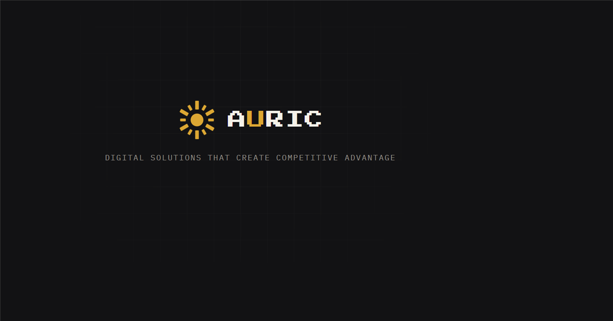
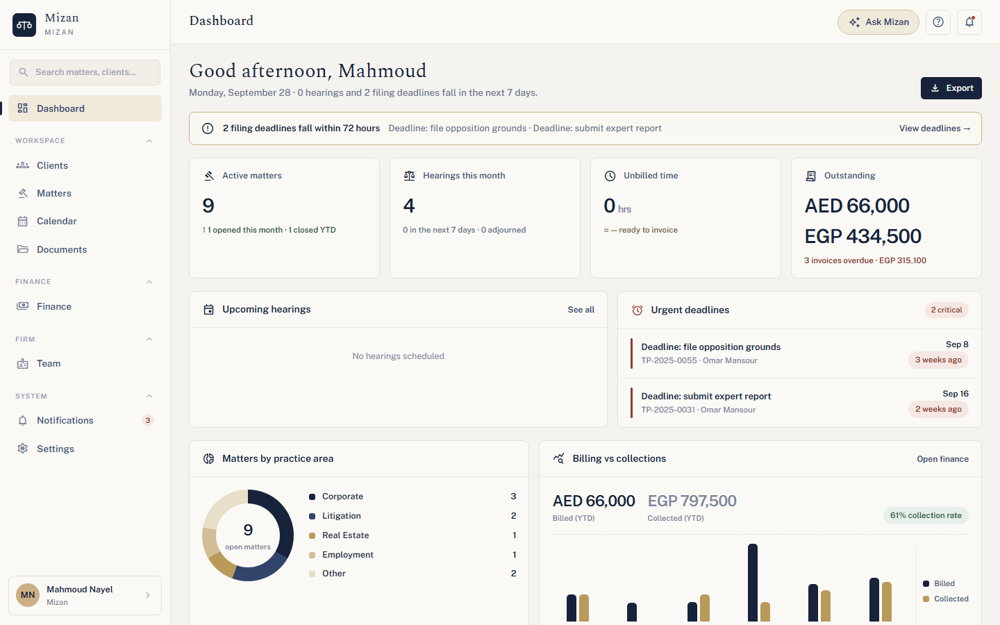
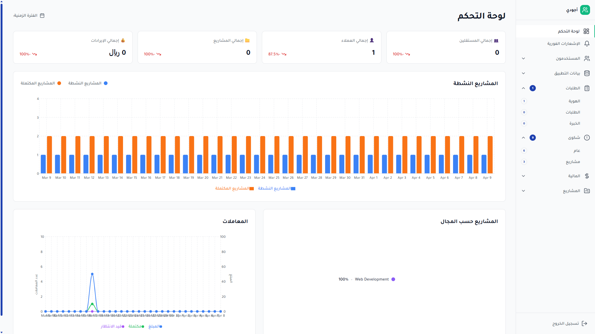
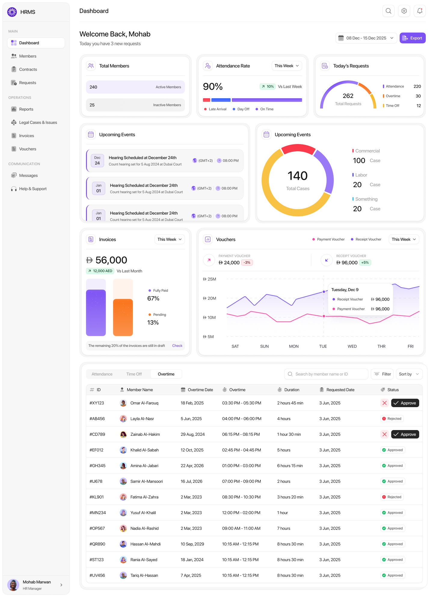
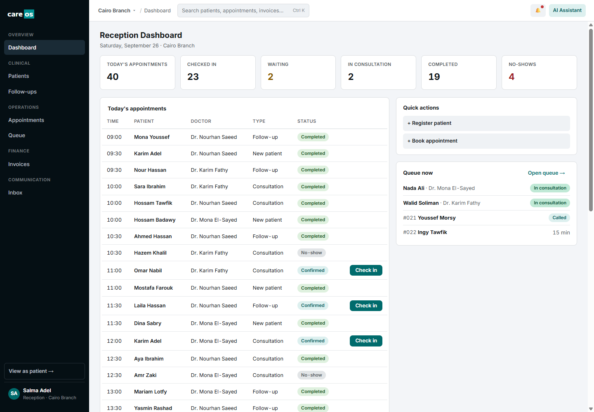
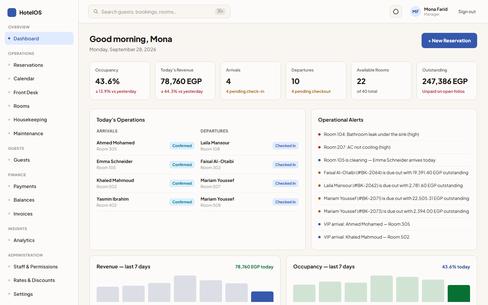
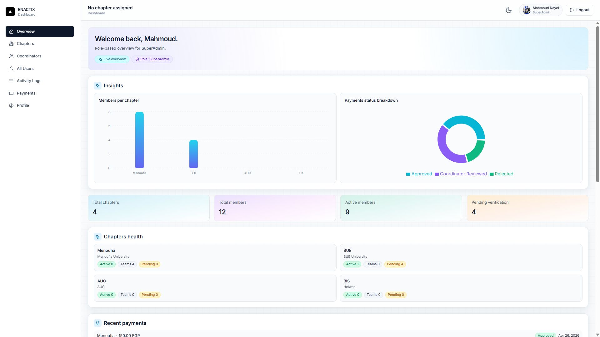
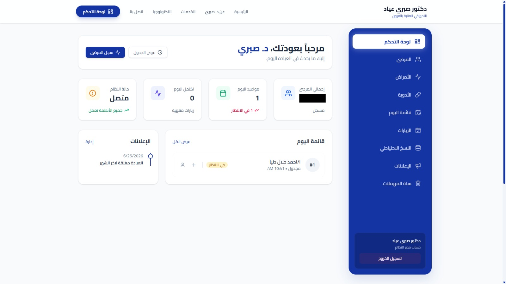

# AURIC: digital product agency website

     

**Live:** https://auric-navy.vercel.app

**AURIC** is a digital product agency founded by **Mahmoud Nayel**. It designs and builds high-performance
websites, custom web applications, AI-powered solutions, business automation, dashboards and API
integrations for ambitious companies. The studio's line is *built to differentiate*.

This repository is the agency's **marketing and portfolio website**: the home page, the full portfolio, a
detailed case study for every project we have shipped, the team page and a contact form.



---

## Contents

- [What it does](#what-it-does)
- [Portfolio](#portfolio)
- [Screenshots](#screenshots)
- [Architecture](#architecture)
- [Tech stack](#tech-stack)
- [Getting started](#getting-started)
- [Environment variables](#environment-variables)
- [Project structure](#project-structure)
- [Adding a project](#adding-a-project)
- [Deployment](#deployment)
- [Known limitations](#known-limitations)

---

## What it does

| Area | What visitors see |
|---|---|
| **Home** | Hero, services marquee, about, services, featured work, process, testimonials, stats and a contact call to action |
| **Services** | Six offers: high-performance websites, custom web applications, AI-powered solutions, business process automation, dashboards and analytics, API integrations |
| **Work** (`/work`) | The full portfolio as a grid, newest flagship products first |
| **Case studies** (`/work/<project>`) | Overview, modules, features, tech stack, architecture, impact and screenshots for each project, with a link to the live product |
| **Process** | Discover, Design, Build, Optimize |
| **Team** (`/team`) | Founders, the team and the studio's values |
| **Contact** | A project-inquiry form that sends an email through EmailJS, with validation and inline feedback |

Across the whole site:

- **Scroll-triggered animation** built on one shared Framer Motion variant set, so every section moves the same way.
- **Responsive layout** with fluid spacing tokens and a collapsible mobile navigation.
- **Social previews** with Open Graph and Twitter meta tags and a branded share image.
- **No router dependency.** Pages are resolved from the URL path in `src/App.tsx`, and `vercel.json` rewrites everything to the SPA shell.

## Portfolio

| Project | What it is | Live |
|---|---|---|
| **Atlas** | Real-estate developer operating system: CRM, inventory, sales, payment plans, finance and an AI Copilot | [atlas-web-eight-xi.vercel.app](https://atlas-web-eight-xi.vercel.app) |
| **Mizan** | Bilingual (English and Arabic, RTL) law-firm management system on web and mobile | [mizan-web-seven.vercel.app](https://mizan-web-seven.vercel.app) |
| **Ajwadi** | Collaboration and project-management platform with an admin dashboard and mobile app | [ajwadi-front.vercel.app](https://ajwadi-front.vercel.app) |
| **Nova** | Enterprise ERP with integrated CRM modules, web dashboard and employee mobile app | [nova-front-me.vercel.app](https://nova-front-me.vercel.app) |
| **Clinic OS** | Clinic operating system on Odoo 19 with a workspace for every role and a patient portal | [github.com/real-GBOY/clinicOS](https://github.com/real-GBOY/clinicOS) |
| **Enactix** | Student-organization management platform with QR attendance and offline sync | [enactix.vercel.app](https://enactix.vercel.app) |
| **Weavolution** | Sustainability and circular-economy marketing site | [wevo-project-mu.vercel.app](https://wevo-project-mu.vercel.app) |
| **Build Art** | Interior design and fit-out marketing site | [build-art-kohl.vercel.app](https://build-art-kohl.vercel.app) |
| **OptiCare** | Clinic management system for ophthalmology practices | [eye-clinics-system.vercel.app](https://eye-clinics-system.vercel.app) |
| **Hotel OS** | Hotel operations platform and public booking website | [hotel-nayel.vercel.app](https://hotel-nayel.vercel.app) |

Atlas, Mizan and Hotel OS are built on the AURIC foundation, a shared application core for identity,
multi-tenancy, permissions, file storage, audit and events, so each new product starts past the plumbing.

## Screenshots

| | |
|---|---|
| **Atlas**: executive dashboard  | **Mizan**: firm dashboard  |
| **Ajwadi**: admin dashboard  | **Nova**: dashboard overview  |
| **Clinic OS**: reception dashboard  | **Hotel OS**: manager dashboard  |
| **Enactix**: dashboard overview  | **OptiCare**: dashboard overview  |

All data in the project screenshots is synthetic demo data.

## Architecture

```
   Browser
   React 18 · Vite · Tailwind 3 · Framer Motion
   ┌──────────────────────────────────────────────┐
   │ App.tsx       path → page (no router library)│
   │ components/   one file per section or page   │
   │ lib/data.ts   every project, service, quote  │      EmailJS
   │ lib/variants  shared animation variants      │ ───► (contact form)
   └──────────────────────────────────────────────┘
        static build on Vercel, SPA rewrite to /
```

The site is a static single-page app with no backend. All content lives in `src/lib/data.ts`, so the pages
are thin views over typed data.

| Principle | How it shows up |
|---|---|
| **Content is data** | Services, work, case studies, steps, testimonials and team are typed objects in `src/lib/data.ts`. |
| **One case-study template** | Every `/work/<project>` page renders the same `CaseStudy` component from a `CaseStudyProject` object. |
| **One motion language** | `src/lib/variants.ts` defines the fade, stagger and slide variants that every section reuses. |
| **Theme as tokens** | The gold accent, spacing and gutters are CSS custom properties, consumed by Tailwind. |

## Tech stack

| Layer | Choices |
|---|---|
| Build | Vite 8, TypeScript |
| UI | React 18, Tailwind CSS 3, Framer Motion, Lucide React |
| Forms and email | EmailJS (`@emailjs/browser`) |
| Quality | ESLint 9 with typescript-eslint, `tsc --noEmit` |
| Hosting | Vercel |

## Getting started

Prerequisites: Node.js 20+ and npm.

```bash
npm install
cp .env.example .env     # then fill in the EmailJS values
npm run dev
```

| Command | Description |
| --- | --- |
| `npm run dev` | Start the Vite development server |
| `npm run build` | Build for production |
| `npm run preview` | Preview the production build locally |
| `npm run lint` | Run ESLint over the project |
| `npm run typecheck` | Run `tsc --noEmit` against `tsconfig.app.json` |

## Environment variables

Create a `.env` file in the project root:

```bash
VITE_EMAILJS_SERVICE_ID=      # EmailJS service
VITE_EMAILJS_TEMPLATE_ID=     # EmailJS template used for project inquiries
VITE_EMAILJS_PUBLIC_KEY=      # EmailJS public key
```

These are read by `src/components/CTA.tsx`. They are public browser keys, not secrets, but they are still
kept out of the source where possible. Without them the contact form cannot send.

## Project structure

```
src/
├── App.tsx           Path-based page routing
├── main.tsx          Entry point
├── index.css         Design tokens and global styles
├── components/       Nav, Hero, Marquee, About, Services, Work, AllWork, CaseStudy, Process,
│                     Testimonials, StatsBar, CTA, Team, Footer, NotFound, ...
└── lib/
    ├── data.ts       Services, portfolio, case studies, steps, testimonials, team
    └── variants.ts   Shared Framer Motion variants
public/
├── work/<project>/   Screenshots for each case study
├── favicon.svg
└── og-image.png      Social share image
```

## Adding a project

1. Copy the screenshots into `public/work/<slug>/`.
2. In `src/lib/data.ts`, add a `CaseStudyProject` object, then add a row to `ALL_WORKS` (and to `WORKS` to
   feature it on the home page). The position in `ALL_WORKS` is the order on the `/work` page.
3. In `src/App.tsx`, import the object and add `if (path === '/work/<slug>') return <CaseStudy project={...} />;`.
4. Run `npm run typecheck` and `npm run build`.

## Deployment

The site is a static Vite build hosted on **Vercel** (project `auric`, SPA rewrite in `vercel.json`).
Every push to `main` deploys to production. Set the `VITE_EMAILJS_*` variables in the Vercel project for the
contact form to work in production.

## Known limitations

- The team page, testimonials and the statistics bar use placeholder content and should be replaced with
  real people, quotes and figures.
- The project screenshots are demo data, not client data.
- Case studies are static: adding or changing a project means editing `src/lib/data.ts` and redeploying.
- There is no router library, so navigation between pages is a full page load.

## License

Internal project. All rights reserved. © AURIC, founded by Mahmoud Nayel.
